<p align="center">
  
</p>

<h1 align="center">CashMatrix</h1>

<p align="center">
  <strong>All your money, bills and dates in one place.</strong><br>
  A full-stack personal finance tracker: link your bank, see where your money goes, set budgets,<br>
  and get reminded before every payment is due.
</p>

<p align="center">
  
  
  
  
  
  
  
</p>

<p align="center">
  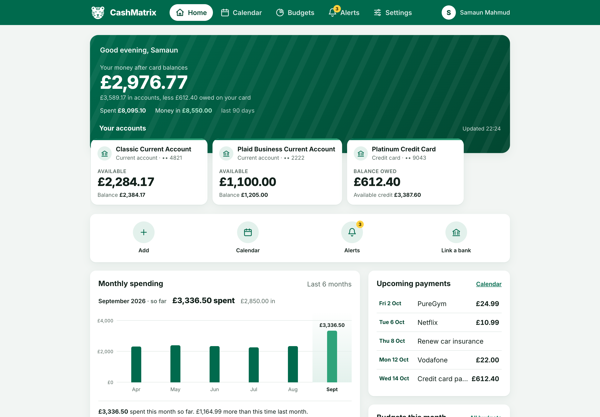
</p>

---

## Highlights

- **Bank connections** through Plaid (UK banks by default), with up to two years of history on the first import and a background sync every four hours
- **A clear picture of your money**: balance after card debt, spending by category or retailer, and month-by-month trends compared with last month
- **Subscriptions found for you**: weekly, monthly and yearly charges are spotted in your transactions and added to your calendar in one tap
- **Budgets** per category, with warnings at 80% and when you go over
- **Payment calendar** for bills, subscriptions and tasks, with repeats and a reminder before each one
- **Alerts** in the app, by email and as push notifications on your phone, including money in and out
- **Passkey login** with fingerprint or face (WebAuthn)
- **Works on phones**: responsive layout with a bottom navigation bar, installable to the Home Screen

## Screenshots

### Accounts and statements
Every account has a searchable statement grouped by day, with money in / money out filters and pending labels.

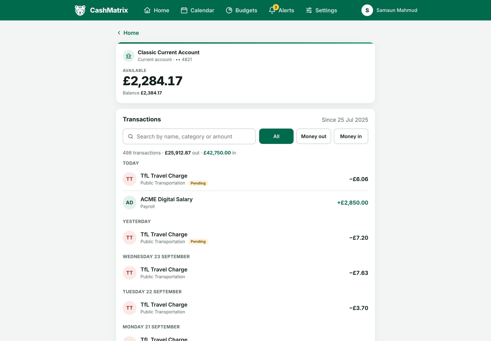

### Calendar
Payments, subscriptions and tasks on a month view, with what's coming up in the next 30 days.

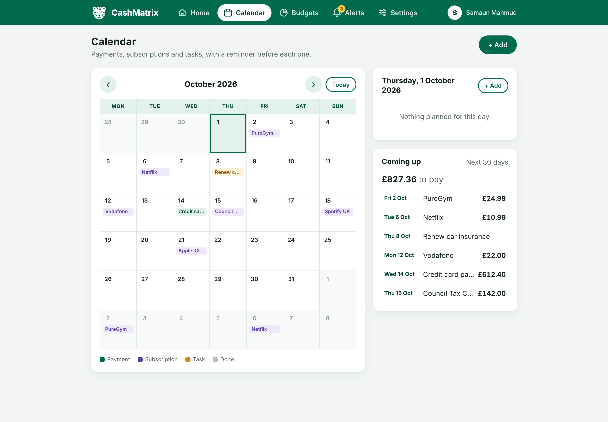

### Budgets
Monthly limits per category that turn amber near the limit and red when you go over, plus a daily allowance for the rest of the month.

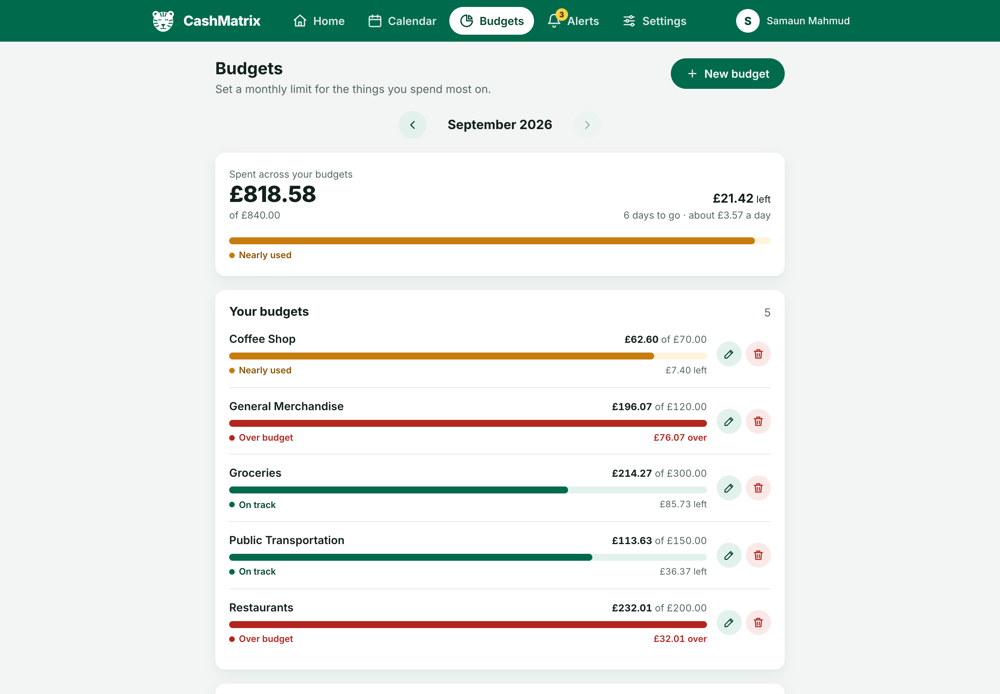

### Alerts
Budget warnings, payment reminders and money in / out, with an unread count on the bell.

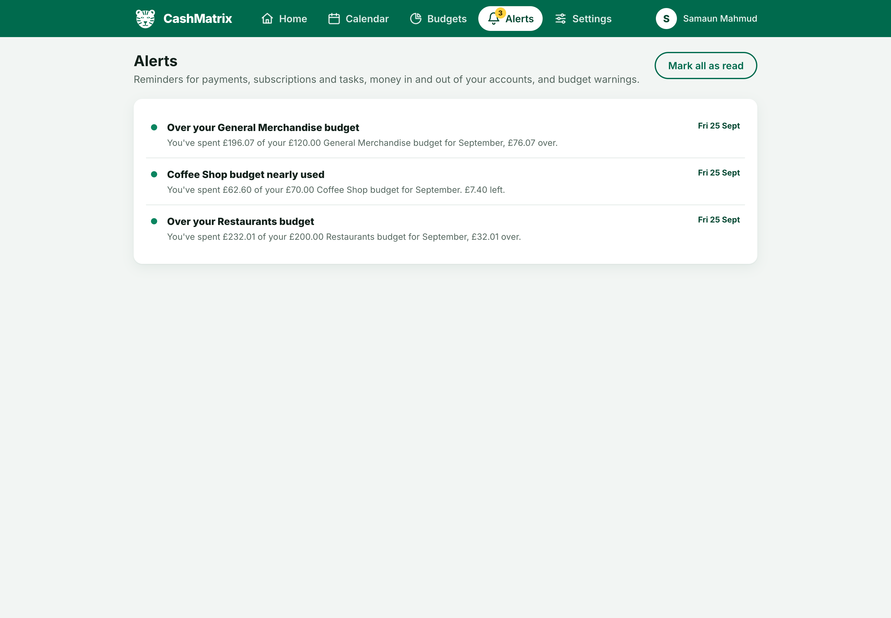

### On your phone

<table>
  <tr>
    <td align="center">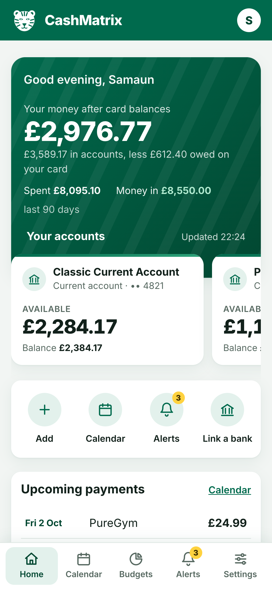<br><sub>Home</sub></td>
    <td align="center">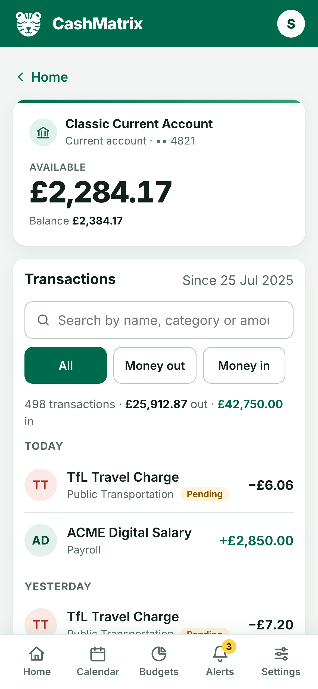<br><sub>Statement</sub></td>
    <td align="center">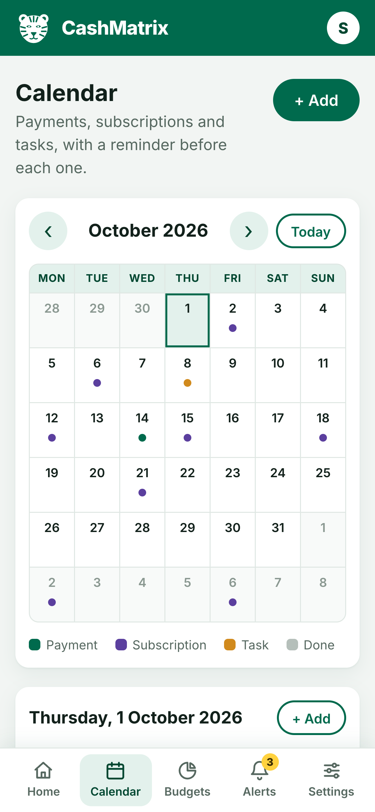<br><sub>Calendar</sub></td>
    <td align="center">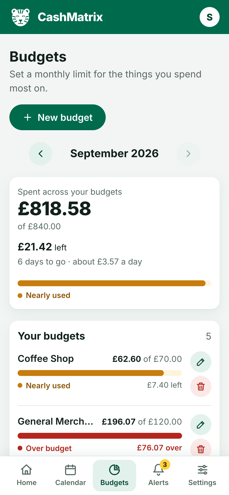<br><sub>Budgets</sub></td>
  </tr>
</table>

### Sign in
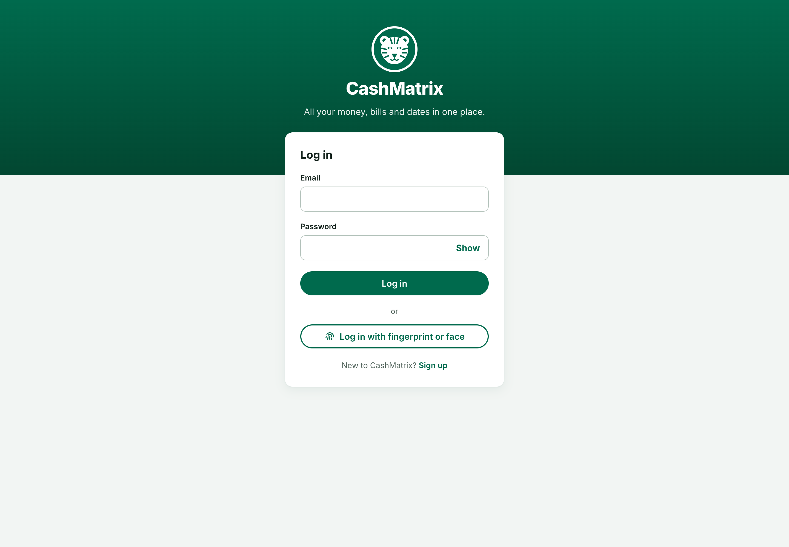

<sub>All screenshots use made-up demo data.</sub>

## How it works

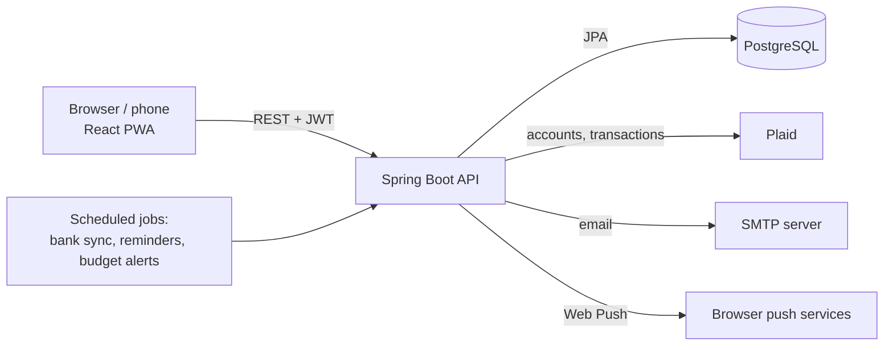

- The **React** frontend talks to a stateless **Spring Boot** REST API using JWTs (or passkeys to sign in).
- The API links banks through **Plaid**, stores accounts and transactions in **PostgreSQL**, and never sends the Plaid access token to the browser.
- **Scheduled jobs** sync banks, create reminders and check budgets, then deliver alerts in the app, by email and through Web Push (VAPID).

## Tech stack

| Area | Technology |
|---|---|
| Backend | Java 17, Spring Boot 3.3, Spring Security, Spring Data JPA, WebFlux client |
| Auth | JWT, BCrypt, passkeys (Yubico `webauthn-server-core`) |
| Data | PostgreSQL (H2 for tests) |
| Banking | Plaid (Link, transactions, balances) |
| Notifications | Spring Mail, Web Push with VAPID |
| Frontend | React 19, Vite, React Router, Axios, `react-plaid-link` |
| Design | Hand-written CSS with design tokens, Inter font, PWA manifest and service worker |
| Deployment | Docker, Render (API and database), Vercel (frontend) |

## Project structure

| Folder | What it is |
|---|---|
| [`backend/`](backend) | Spring Boot API: auth, Plaid, calendar, reminders, budgets, insights, subscription detection ([README](backend/README.md)) |
| [`frontend/`](frontend) | React app ([README](frontend/README.md)) |
| [`design/`](design) | Vector screens (SVG) and design tokens that open in Figma, Penpot or Sketch ([README](design/README.md)) |
| [`docs/screenshots/`](docs/screenshots) | The screenshots above |

## Running it locally

**You'll need:** Java 17+, Node 20+, PostgreSQL (or Docker), and free [Plaid sandbox keys](https://dashboard.plaid.com).

1. **Database.** Create a PostgreSQL database called `expense_tracker`, or start one with Docker:

   ```bash
   docker run -d --name cashmatrix-db -p 5432:5432 \
     -e POSTGRES_DB=expense_tracker -e POSTGRES_USER=cashmatrix -e POSTGRES_PASSWORD=cashmatrix \
     postgres:16-alpine
   ```

2. **Backend.** Copy `backend/src/main/resources/application-example.properties` to `application.properties`, fill in your database and Plaid sandbox keys, then:

   ```bash
   cd backend
   ./mvnw spring-boot:run
   ```

   The API starts on `http://localhost:8080`.

3. **Frontend.**

   ```bash
   cd frontend
   npm install
   npm run dev
   ```

   Open `http://localhost:5173`, sign up, and link a sandbox bank with the username `user_good` and password `pass_good`.

## Tests

```bash
cd backend && ./mvnw test      # 100+ tests, in-memory database
cd frontend && npm run lint
```

## Deploying

The API and database go on Render (`render.yaml`) and the frontend on Vercel (`frontend/vercel.json`). See [DEPLOYING.md](DEPLOYING.md) for the steps and every setting.

## Security notes

- Passwords are hashed with BCrypt; sessions use JWTs that expire after a day, and a stale token can never block logging in.
- Plaid access tokens stay on the server. The API only accepts browser requests from the app's own address.
- Push notifications are only sent to real browser push services, and passkey challenges expire after five minutes.
- Secrets come from environment variables; none are stored in the repository.

---

<sub>CashMatrix is a personal finance tracker, not a bank. It reads account data through Plaid and never moves money.</sub>
